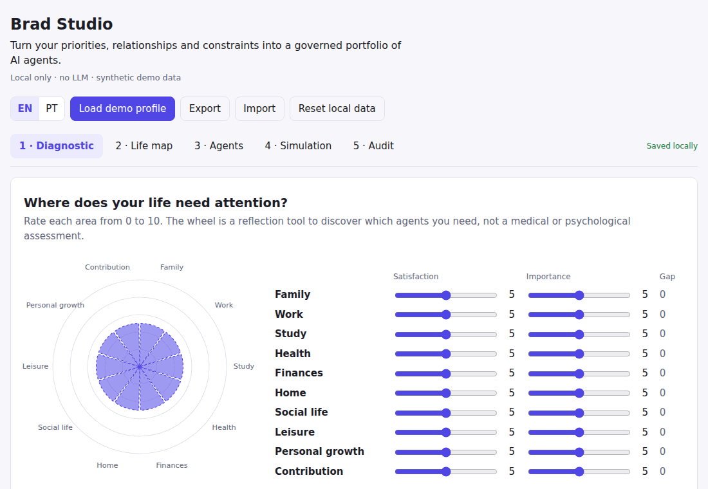

# Brad

**Brad is a local-first control plane that transforms a person's priorities, relationships and constraints into a governed portfolio of AI agents.**

> **Status:** functional local MVP. The diagnostic, life map, agent generation, lifecycle, permission grants, policy simulation, correction loop, audit and import/export run today. External adapters and real-world inbox/calendar integrations are not implemented yet.



## Run it

Requires Node.js ≥ 22.13 and pnpm (`corepack enable`).

```bash
git clone https://github.com/mayarapaolini/brad-open-source.git && cd brad-open-source
pnpm install
pnpm dev
```

Open <http://127.0.0.1:5173> and click **Load demo profile**. Everything runs on your machine. The API only listens on `127.0.0.1`, and data lives in `.brad/brad.db`.

## What the MVP does

1. **Diagnostic:** you rate each life area for satisfaction and importance. The Wheel of Life is only the discovery step that shows which agents you need. It is not a medical or psychological assessment.
2. **Life map:** you edit goals, the people who matter (relationship, priority, who may interrupt quiet hours) and boundaries: quiet hours, capabilities no agent may ever use, and areas where Brad must always ask first.
3. **Draft agents:** Brad proposes one agent for each area that matters a lot or is neglected. Every agent starts as a `draft` with **no permissions**. Capabilities are only *requested*, and those your boundaries forbid are dropped.
4. **Simulation:** Brad ranks a synthetic inbox and answers questions like *"why did this family message get priority?"* Each score is a sum of named rules you can inspect.
5. **Policy engine:** you ask *"can this agent do this?"* and get `allow`, `deny` or `confirm` with a full rule trace. Deny by default, fixed rule order, and no LLM involved.
6. **Governance:** an agent moves `draft → configured → simulated → approved → active` only when it has a goal, requested capabilities, a policy simulation you have seen and a current grant. You grant capabilities for 30 days and can revoke them at any time; a revoked grant denies the action immediately.
7. **Correction loop:** when a ranking looks wrong, mark the item as *should be Now / Today / Later*. Brad records the feedback, proposes one concrete life-map change (for example *"Let Jordan Blake interrupt quiet hours: score 61 → 86, Today → Now"*) and applies it only when you click. Adding a new person is never automatic.
8. **Audit:** every simulation, lifecycle change and permission change is recorded locally and shown newest first. Export/import moves your life map, agents and grants as JSON; imported active agents arrive paused.

## Works today · in development · planned

| Works today | In development | Planned |
| --- | --- | --- |
| Local Studio (EN/PT) | CLI for validation and migrations | Encryption at rest for the local store |
| Wheel of Life diagnostic | | Optional adapters: Inkus, Obsidian, Hermes |
| Editable life map: goals, people, boundaries | | Real inbox and calendar connectors |
| Draft agent generation (no grants) | | Narrow, confirm-first automation recipes |
| Agent lifecycle with enforced requirements | | Threat model and security review |
| Time-boxed grants with revocation | | |
| Explainable priority simulation | | |
| Correction loop: feedback → suggested change → apply | | |
| Deterministic policy engine with what-if checks | | |
| Local decision history (audit view) | | |
| JSON export/import with validation | | |
| Local SQLite persistence (`node:sqlite`) | | |
| Synthetic demo profile | | |
| Unit tests for permission, denial, lifecycle and prioritisation, plus a browser end-to-end test | | |
| CI: lint, typecheck, tests, build, e2e | | |

## Optional adapters (not required, not implemented yet)

- **Inkus:** would publish approved agent definitions and documentation. It never receives credentials or the full profile.
- **Obsidian:** would import and export Markdown notes you pick. It never scans a whole vault.
- **Hermes:** would run approved agents and show their runs, always behind Brad's policy engine.

The MVP runs without any of them. See [docs/INTEGRATIONS.md](docs/INTEGRATIONS.md).

## Repository layout

| Path | Purpose |
| --- | --- |
| `apps/studio` | React + Vite interface: diagnostic, life map, agents, simulation |
| `apps/api` | Localhost-only HTTP API and SQLite store |
| `packages/domain` | Life map types, validation, synthetic demo data |
| `packages/agent-factory` | Life map → draft agents |
| `packages/priority-engine` | Explainable ranking of incoming items |
| `packages/policy-engine` | Deterministic allow / deny / confirm decisions |

```bash
pnpm lint && pnpm typecheck && pnpm test   # fast checks
pnpm build && pnpm test:e2e                # browser flow (needs a Playwright Chromium)
pnpm demo:gif                              # re-record docs/assets/demo.gif
```

## Safety principles

- local-first; no network services and no LLM in the MVP
- deny by default and least privilege; drafts can never act
- no credentials in profiles, prompts, logs or exports
- confirmation before consequential actions (send, schedule, delete, pay)
- every decision is explainable and recorded locally
- only synthetic data in examples, tests and screenshots

Read [SECURITY.md](SECURITY.md) and [CONTRIBUTING.md](CONTRIBUTING.md) before contributing. How Brad is built, including the use of Claude Code as a development partner: [DEVELOPMENT.md](DEVELOPMENT.md). Architecture: [docs/ARCHITECTURE.md](docs/ARCHITECTURE.md) and decision records in [docs/adr](docs/adr). Roadmap: [docs/ROADMAP.md](docs/ROADMAP.md).

Licensed under Apache-2.0.
